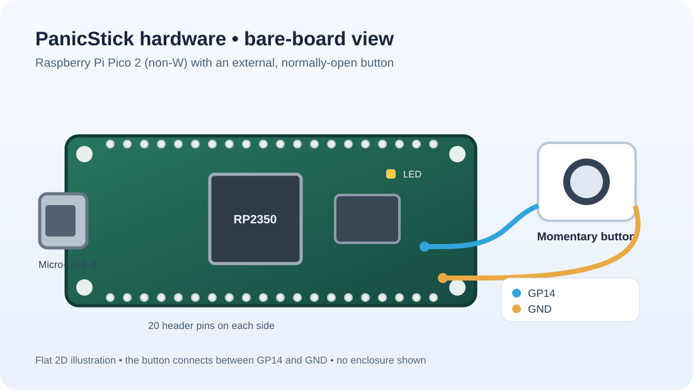
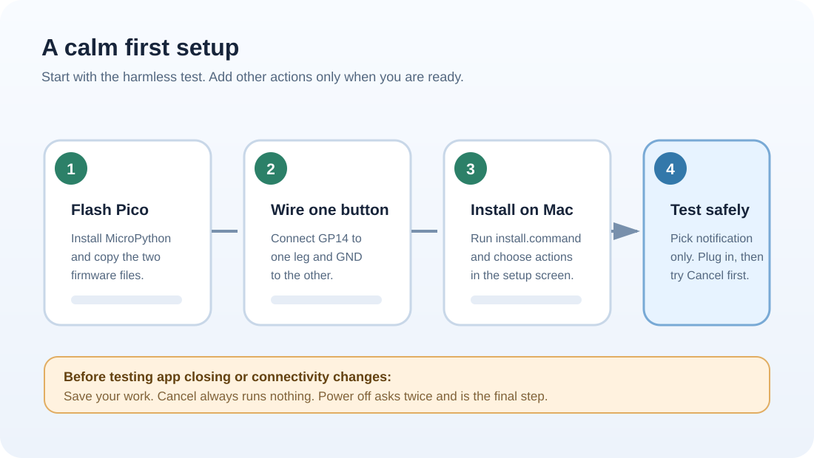
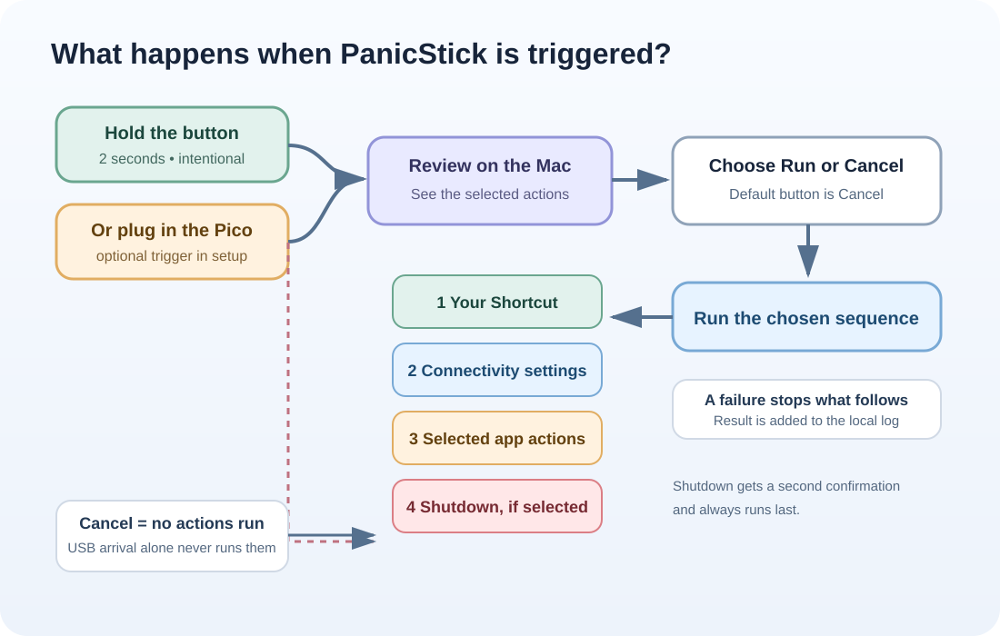
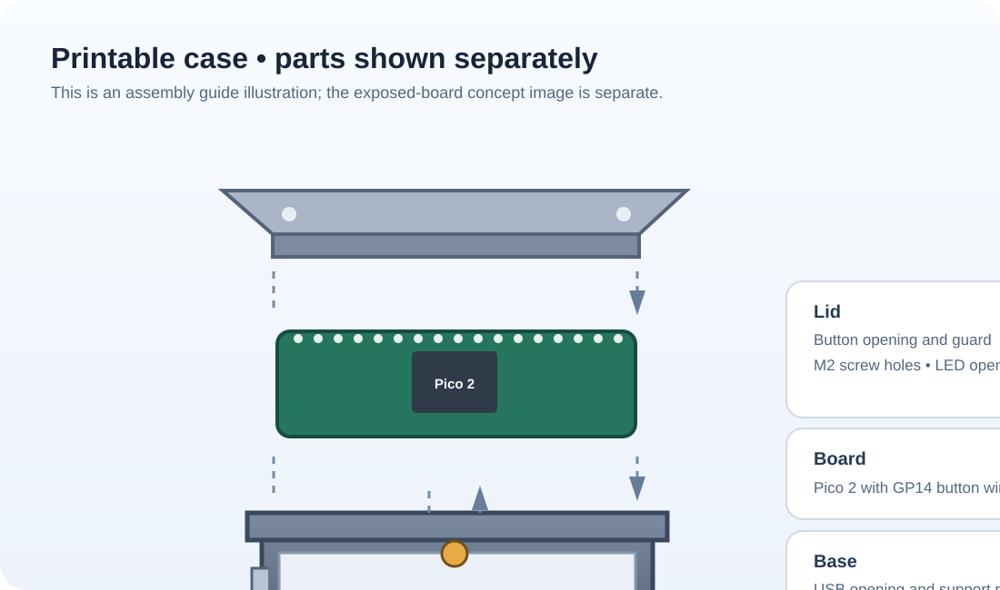

# PanicStick

**A button for starting a Mac emergency-response routine you chose.**

PanicStick pairs a Raspberry Pi Pico 2 (the non-W model) with a small Mac app. You can ask the app to show a review screen when the Pico is plugged in, or trigger it by holding the physical button for two seconds.

> **This is a prototype.** Some choices can close apps, disconnect your Mac, or shut it down. Begin with notifications only and save your work before trying anything else.

## Start here

New to coding or electronics? Follow the [step-by-step beginner guide](docs/install-for-beginners.md). You can test PanicStick on your desk without printing the case.\n\n

## How it works

The Pico sends a small JSON message over USB. The Mac app checks the message and follows your setup choice: review every run, or unattended mode with optional confirmation checkpoints before selected actions. USB insertion starts the workflow only if you enabled that trigger.

See the [unattended response flow](docs/images/response-flow-unattended.svg), [unattended setup flow](docs/images/setup-flow-unattended.svg), and [confirmation checkpoints](docs/images/confirmation-checkpoints.svg).

The [checkpoint placement guide](docs/images/checkpoint-placement-guide.svg) and [mode decision diagram](docs/images/confirmation-mode-decision.svg) explain where pauses fit and when unattended mode is useful.

The Mac runs the Shortcut before connectivity and app actions, and shutdown last. You can place confirmation checkpoints before selected actions; the shutdown checkpoint starts selected when shutdown is enabled. If an action fails, the rest of the sequence stops. Events are recorded on your Mac.

## What you can choose

The setup screen includes notification, quit selected apps, quit all apps, turn off Wi-Fi, turn off Bluetooth with the optional `blueutil` utility, turn off incoming SSH/Remote Login, open Sharing settings for you to change manually, quit selected virtual-machine apps, run one of your Shortcuts, quit Terminal, and shut down the Mac.

Some choices have limits: PanicStick cannot guarantee that a headless virtual machine has stopped, and it opens Sharing settings rather than changing Screen Sharing for you. Read the [action details](docs/actions.md) before enabling anything disruptive.

## Build it

You’ll need a Pico 2 (non-W), a normally-open momentary button, two short wires, and a Micro-USB-B data cable. Connect the button between GP14 and GND. Do not connect the button to 3V3.

The enclosure is optional. The editable [OpenSCAD model](cad/panicstick_case.scad) and print-ready [base](cad/printable/panicstick_base.stl) and [lid](cad/printable/panicstick_lid.stl) are in the repository.

See the [wiring diagram](docs/button-wiring.svg), [case dimensions](cad/panicstick-dimensions.svg), and [printing and assembly guide](docs/cad-printing.md).

## Try the code

- `pico/main.py` and `pico/button_monitor.py`: Pico 2 MicroPython firmware.
- `mac/panicstick.py` and `mac/panicstick_core.py`: Mac setup, USB monitoring, confirmation, and actions.
- `mac/install.command` and `mac/uninstall.command`: per-user setup and removal.
- `docs/protocol.md`: USB message format.
- `docs/testing.md`: hardware and Mac test checklist.
- `tests/`: automated protocol, settings, action-order, button, and artwork checks.

Read the [confirmation and takeover warning](docs/confirmation-and-security.md). The [image bundle](docs/images/PanicStick-diagrams.zip) contains both original and new diagrams. See [how to run the tests](docs/testing.md). Hardware checks still need a Pico and a Mac. On your Mac, run `panicstick.py --doctor` for a read-only setup check or `panicstick.py --show-log` to view the latest local event records.

## Open source

PanicStick is open source under the [MIT License](LICENSE). Browse, download, change, and share the code and design files.

You don’t need a package to try a prototype. A repository ZIP is enough. A tagged GitHub release will help when a version is ready for others to use; a signed Mac installer can come later.
